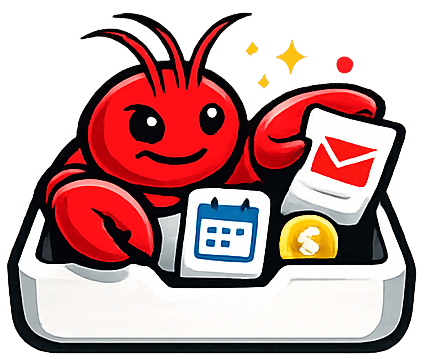

# Inboxclaw

Inboxclaw is a small self-hosted event hub for your personal digital life.

It watches the services you already use, turns their changes into a clean local stream of events, deduplicates noisy updates, stores them durably, and makes them easy to consume from your own apps, automations, and assistants.

Instead of wiring every API to every downstream tool, you connect each source once and get one place where new emails, calendar changes, bank transactions, file updates, and other signals show up in a consistent way.

## Why use it

Modern personal tooling is fragmented. Your inbox lives in one place, your calendar in another, files in a third, banking in a fourth, and device state somewhere else again.

Inboxclaw gives you a single event layer across those systems.

That makes it useful when you want to:

* power a personal assistant or LLM workflow with real-world events
* build automations without re-implementing polling and deduplication for every API
* keep a durable local record of interesting changes
* expose those changes through webhooks, SSE, or pull-based consumers
* prototype a personal operations hub without standing up heavy infrastructure

## What it does

Inboxclaw does:

* polls or subscribes to supported external services
* converts changes into normalized events
* stores them in SQLite
* deduplicates repeated fetches
* delivers matching events to one or more sinks
* supports coalescing for noisy update streams

In practice, it is best thought of as an event inbox for personal systems and assistant-facing workflows.

## Current shape

In very active development, some features are missing, might break at any time.

It is a good fit for:

* personal automation
* local or self-hosted assistant backends
* side projects and internal tools
* lightweight integration glue

## Supported sources

* ✉️ Gmail
* 📅 Google Calendar
* 💾 Google Drive
* 🏦 Fio Banka
* 🧾 Faktury Online
* 🏠 Home Assistant
* 💳 GoCardless Bank Account Data (Nordigen)
* 🧪 Mock source for testing

## Supported sinks

* Webhook
* Server-Sent Events (SSE)
* HTTP Pull

## Quick Start

1. **Clone the Repo**:
   ```bash
   git clone https://github.com/your-repo/inboxclaw.git
   cd inboxclaw
   ```

2. **Configure**:
   - Create a `.env` file for your API tokens.
   - Create a `config.yaml` by copying `config.example.yaml` as a template.
   - **Note for Google Services**: If you use Gmail, Google Calendar, or Google Drive, you will need to perform a one-time authentication step using the CLI: `python main.py google auth`. An API key is not enough.

3. **Run**:
   ```bash
   python main.py listen
   ```
   *The first run will automatically set up a virtual environment and install dependencies.*

## Learn more

Detailed documentation lives in the [`docs/`](docs) folder.

Start here:

* [Getting started and overview](docs/index.md)
* [Configuration](docs/configuration.md)
* [App lifecycle](docs/app-lifecycle.md)
* [Pipeline](docs/pipeline.md)
* [Data model](docs/data-model.md)
* [Sources overview](docs/sources-general.md)
* [Sinks overview](docs/sinks-general.md)
* [Google auth CLI](docs/google-auth-cli.md)

Source-specific docs:

* [Gmail](docs/source-gmail.md)
* [Google Calendar](docs/source-google-calendar.md)
* [Google Drive](docs/source-google-drive.md)
* [Fio](docs/source-fio.md)
* [Faktury Online](docs/source-faktury-online.md)
* [Home Assistant](docs/source-home-assistant.md)
* [Nordigen](docs/source-nordigen.md)
* [Mock source](docs/source-mock.md)

Sink-specific docs:

* [Webhook](docs/sink-webhook.md)
* [SSE](docs/sink-sse.md)
* [HTTP Pull](docs/sink-http-pull.md)
* [Win11 Toast](docs/sink-win11toast.md)

## AI Disclaimer

This project is built using AI. It may contain inaccuracies or errors. Please consider this and do not rely on it for critical decisions.