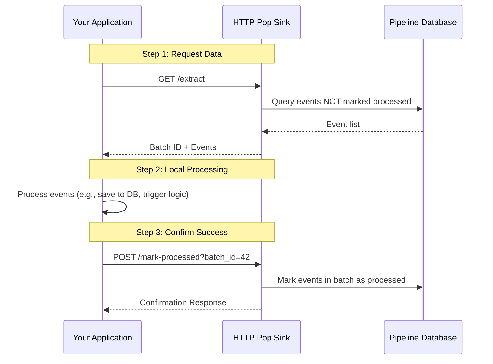

# HTTP Pop Sink (The Pull-Based Delivery Model)

The HTTP Pop Sink is a robust and reliable mechanism for retrieving event data from the pipeline. Unlike "push-based" systems (like Webhooks), where the server initiates data transfer, the HTTP Pop Sink follows a **pull-based model**. In this model, your application decides when to request data, processes it at its own pace, and explicitly confirms successful receipt.

### Is this the right choice for you?

| Use Case                                                                                                                                                                         | Key Considerations                                                                                                                    |
|:---------------------------------------------------------------------------------------------------------------------------------------------------------------------------------|:--------------------------------------------------------------------------------------------------------------------------------------|
| **High Reliability**: Data remains in the pipeline until your system confirms it has been safely processed. If your application crashes during processing, the data is not lost. | **Polling Latency**: There is a slight delay between when an event occurs and when your application pulls it.                         |
| **Backpressure Management**: You control the flow of data. If your system is under heavy load, you can slow down your requests without being overwhelmed by incoming traffic.    | **Two-Step Interaction**: Requires two separate API calls: one to "Extract" (get data) and one to "Mark Processed" (confirm receipt). |
| **Restricted Network Environments**: Ideal for applications behind a firewall or NAT that cannot receive unsolicited incoming HTTP requests.                                     |                                                                                                                                       |

---

## How it Works

### 1. The Pull and Confirm Lifecycle
The Pop Sink ensures data integrity through a simple, atomic request-response cycle. Crucially, **events remain in the "Unprocessed" state and will be returned by subsequent `GET /extract` calls until they are explicitly confirmed.**



**Practical Example (Inventory Management):**
Consider a system tracking inventory updates from multiple warehouses.
1. **Extract**: Your application requests the latest batch of updates.
2. **Response**: The sink returns 50 updates (e.g., stock changes for Item A, B, and C) assigned to `batch_id: 105`.
3. **Processing**: Your application starts updating its local inventory database.
4. **Retry Logic**: If your application crashes *before* it can confirm `batch_id: 105`, the next time it calls **Extract**, it will receive the same 50 updates again. This ensures zero data loss.
5. **Mark Processed**: Once the database update is successful, your application confirms `batch_id: 105`.
6. **Outcome**: These specific updates are now marked as `processed` and will no longer be returned in future requests.

### 2. Understanding Core Concepts

#### Batching
To improve performance, the Pop Sink groups events into **batches**. Instead of making one network request per event, your application can request multiple events at once (e.g., 100 events in a single call). This significantly reduces network overhead.

#### Coalescing (Event De-duplication)
In high-frequency environments, a single entity might trigger multiple updates in a short period (e.g., a "Price Update" event occurring 5 times for the same product within seconds).
- **The Problem**: Processing every intermediate state can be wasteful and redundant.
- **The Solution**: Coalescing merges these related updates into a single "final state" event.
- **Benefits**: Your application processes less data while still receiving the most current state of the entity.

---

## Configuration (`config.yaml`)

### Minimal Configuration
The most basic setup. By default, it will expose endpoints at `/http_pop/extract` and `/http_pop/mark-processed`.

```yaml
sink:
  http_pop: {} 
```

### Named Sink with Filtering
You can assign a custom name to the sink and restrict it to specific event types using the `match` parameter.

```yaml
sink:
  accounting_service:
    type: 'http_pop'
    match: 'invoice.*' # Only events starting with "invoice." will be available
```

### Full Configuration Example
This example shows custom paths, multiple match patterns, and enabled coalescing.

```yaml
sink:
  data_warehouse_sync:
    type: 'http_pop'
    path:
      extract: '/fetch'                 # Access via: /data_warehouse_sync/fetch
      mark_processed: '/acknowledge'    # Access via: /data_warehouse_sync/acknowledge
    match:
      - 'sales.order.*'                # Match all order events
      - 'inventory.update'             # Match specific inventory updates
    coalesce:
      - 'inventory.update'             # Merge multiple inventory updates for the same item
```

---

## API Documentation

### 1. Extract Events
Retrieves a batch of unprocessed events based on the sink's configuration.

**Endpoint:** `GET /{sink_name}/extract`

**Optional Parameters:**
- `event_type`: Filter by a specific event type (e.g., `?event_type=sales.order.created`). Supports wildcards like `sales.*`.
- `batch_size`: Limit the number of events returned in the batch (e.g., `?batch_size=50`).

**Response Example:**
```json
{
  "batch_id": 2048,
  "events": [
    { 
      "id": 12345, 
      "event_type": "sales.order.created", 
      "data": { "order_id": "ORD-789", "amount": 150.00 } 
    }
  ],
  "remaining_events": 42
}
```
*Note: If `remaining_events` is greater than 0, it indicates more data is waiting. You should continue polling until this count reaches 0.*

### 2. Confirm Processing (Mark Processed)
Confirms that a specific batch has been successfully handled.

**Endpoint:** `POST /{sink_name}/mark-processed?batch_id={id}`

Always call this endpoint **after** your application has successfully committed the data to its own storage. If a batch is never confirmed, its events will be returned in future calls to `GET /extract` to ensure no data is lost.

**Response Example:**
```json
{
  "status": "success",
  "marked_count": 50
}
```
