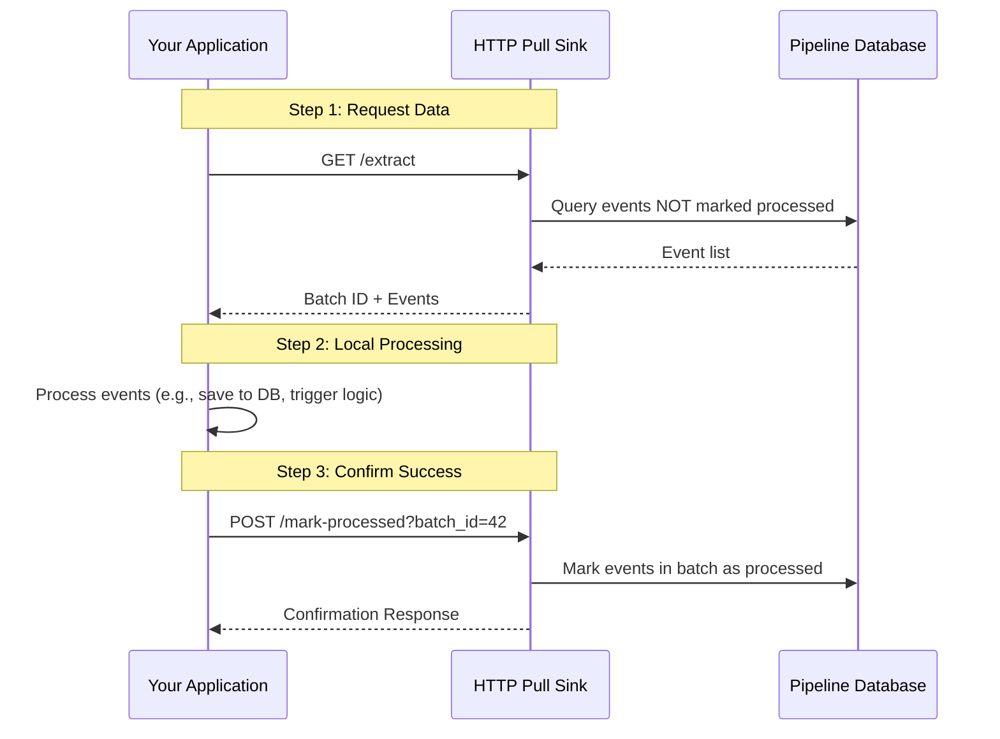

# HTTP Pull Sink (The Pull-Based Delivery Model)

The HTTP Pull Sink is a robust and reliable mechanism for retrieving event data from the pipeline. Unlike "push-based" systems (like Webhooks), where the server initiates data transfer, the HTTP Pull Sink follows a **pull-based model**. In this model, your application decides when to request data, processes it at its own pace, and explicitly confirms successful receipt.

### Is this the right choice for you?

| Use Case                                                                                                                                                                         | Key Considerations                                                                                                                    |
|:---------------------------------------------------------------------------------------------------------------------------------------------------------------------------------|:--------------------------------------------------------------------------------------------------------------------------------------|
| **High Reliability**: Data remains pending until your system confirms it has been safely processed. If your application crashes during processing, the same events can be pulled again as long as they have not expired under TTL rules. | **Polling Latency**: There is a slight delay between when an event occurs and when your application pulls it.                         |
| **Backpressure Management**: You control the flow of data. If your system is under heavy load, you can slow down your requests without being overwhelmed by incoming traffic.    | **Two-Step Interaction**: Requires two separate API calls: one to "Extract" (get data) and one to "Mark Processed" (confirm receipt). |
| **Restricted Network Environments**: Ideal for applications behind a firewall or NAT that cannot receive unsolicited incoming HTTP requests.                                     |                                                                                                                                       |

---

## How it Works

### 1. The Pull and Confirm Lifecycle
The Pull Sink ensures data integrity through a simple, atomic request-response cycle. Crucially, **events remain in the "Unprocessed" state and will be returned by subsequent `GET /extract` calls until they are explicitly confirmed, unless TTL filtering hides them first.**

If you want classic queue-like behavior where unconfirmed events keep reappearing indefinitely, set `ttl_enabled: false`. In the default configuration, TTL is enabled with a `default_ttl` of `1h`.

#### Complete Separation for Multiple Sinks
The pipeline supports multiple HTTP Pull sinks simultaneously. Each sink has its own independent "delivered" state in the database. This means if you have `sink_a` and `sink_b` both matching the same event:
- `sink_a` can pull and confirm the event.
- `sink_b` will still see the same event as unprocessed until it pulls and confirms it for itself.

This allows different downstream systems to process the same stream of events at their own pace without interference.



**Practical Example (Inventory Management):**
Consider a system tracking inventory updates from multiple warehouses.
1. **Extract**: Your application requests the next batch of pending updates.
2. **Response**: The sink returns 50 updates (e.g., stock changes for Item A, B, and C) assigned to `batch_id: 105`.
3. **Processing**: Your application starts updating its local inventory database.
4. **Retry Logic**: If your application crashes *before* it can confirm `batch_id: 105`, the next time it calls **Extract**, it will receive the same 50 updates again, as long as those events are still within TTL.
5. **Mark Processed**: Once the database update is successful, your application confirms `batch_id: 105`.
6. **Outcome**: These specific updates are now marked as `processed` and will no longer be returned in future requests.

### 2. Understanding Core Concepts

#### Batching
To improve performance, the Pull Sink groups events into **batches**. Instead of making one network request per event, your application can request multiple events at once (e.g., 100 events in a single call). This significantly reduces network overhead.

#### Coalescing (Event De-duplication)
In high-frequency environments, a single entity might trigger multiple updates in a short period (e.g., a "Price Update" event occurring 5 times for the same product within seconds).
- **The Problem**: Processing every intermediate state can be wasteful and redundant.
- **The Solution**: Coalescing merges these related updates into a single "final state" event.
- **Benefits**: Your application processes less data while still receiving the most current state of the entity.

---

## Configuration (`config.yaml`)

### Minimal Configuration
The most basic setup. By default, it exposes endpoints at `/http_pull/extract` and `/http_pull/mark-processed`.

This minimal configuration also inherits the shared TTL defaults: `ttl_enabled: true` and `default_ttl: '1h'`. That means events older than one hour are hidden from `GET /extract` even if they were never confirmed.

```yaml
sink:
  http_pull: {}
```

### Named Sink with Filtering
You can assign a custom name to the sink and restrict it to specific event types using the `match` parameter.

```yaml
sink:
  accounting_service:
    type: 'http_pull'
    match: 'invoice.*' # Only events starting with "invoice." will be available
```

### Full Configuration Example
This example shows custom paths, multiple match patterns, enabled coalescing, and TTL configuration.

```yaml
sink:
  data_warehouse_sync:
    type: 'http_pull'
    path:
      extract: '/fetch'                 # Access via: /data_warehouse_sync/fetch
      mark_processed: '/acknowledge'    # Access via: /data_warehouse_sync/acknowledge
    match:
      - 'sales.order.*'                # Match all order events
      - 'inventory.update'             # Match specific inventory updates
    coalesce:
      - 'inventory.update'             # Merge multiple inventory updates for the same item
    ttl_enabled: true                  # Enable Time-To-Live (TTL) for events
    default_ttl: '2h'                  # Default TTL of 2 hours for all matched events
    event_ttl:
      'sales.order.created': '24h'     # Specific TTL for order creation events (24 hours)
      'inventory.*': '15m'             # Prefix TTL for all inventory events (15 minutes)
```

---

## Time-To-Live (TTL)

The HTTP Pull Sink supports **Time-To-Live (TTL)** for events. TTL is enabled by default for this sink, with a default value of `1h`. When TTL is enabled, events that are older than their defined TTL are automatically excluded from the results of the `GET /extract` endpoint, even if they were never confirmed.

If your goal is "keep retrying until I explicitly confirm success," disable TTL:

```yaml
sink:
  http_pull:
    ttl_enabled: false
```

### Why use TTL?
- **Relevance**: Some events (like a temporary sensor reading) lose their value if they aren't processed within a short window.
- **Queue Management**: Prevents your application from being overwhelmed by a large backlog of outdated events if it has been offline for a long period.

### How TTL is Calculated
1. **Exact Match**: If the event type (e.g., `sales.order.created`) matches a key in `event_ttl`, that TTL is used.
2. **Prefix Match**: Otherwise, if the event type matches one or more prefix rules in `event_ttl` (e.g., `inventory.*`), the most specific matching prefix is used.
3. **Default TTL**: If no exact or prefix match is found, the `default_ttl` is applied.

*Note: TTL filtering is applied at the time of the `GET /extract` call based on the event's creation time in the pipeline database.*

---

## API Documentation

### 1. Extract Events
Retrieves a batch of pending events based on the sink's configuration. Events are returned in ascending event order, so the sink drains the oldest pending items first.

**Endpoint:** `GET /{sink_name}/extract`

**Optional Parameters:**
- `event_type`: Filter by a specific event type (e.g., `?event_type=sales.order.created`). Supports wildcards like `sales.*`.
- `batch_size`: Limit the number of events returned in the batch (e.g., `?batch_size=50`). Must be a positive integer (`>= 1`).

**Response Example:**
```json
{
  "batch_id": 2048,
  "events": [
    { 
      "id": 12345, 
      "event_type": "sales.order.created", 
      "data": { "order_id": "ORD-789", "amount": 150.00 } 
    }
  ],
  "remaining_events": 42
}
```
*Note: `remaining_events` is the number of items that would currently be returned by `GET /extract` for this sink, including the events in the current response until you confirm them. If coalescing is enabled, this count is based on coalesced output items, not the raw underlying event rows. If `remaining_events` is greater than 0, confirm the batch and continue polling until it reaches 0.*

### 2. Confirm Processing (Mark Processed)
Confirms that a specific batch has been successfully handled.

**Endpoint:** `POST /{sink_name}/mark-processed?batch_id={id}`

Always call this endpoint **after** your application has successfully committed the data to its own storage. If a batch is never confirmed, its events will usually be returned in future calls to `GET /extract` until they are confirmed or expire under TTL.

Batches are acknowledgement handles, not isolated copies of data. The same event can appear in more than one unconfirmed batch. Once that event is confirmed in **any** batch for this sink, it stops appearing in future extracts for that sink, even if an older overlapping batch was never confirmed.

**Response Example:**
```json
{
  "status": "success",
  "marked_count": 50
}
```
