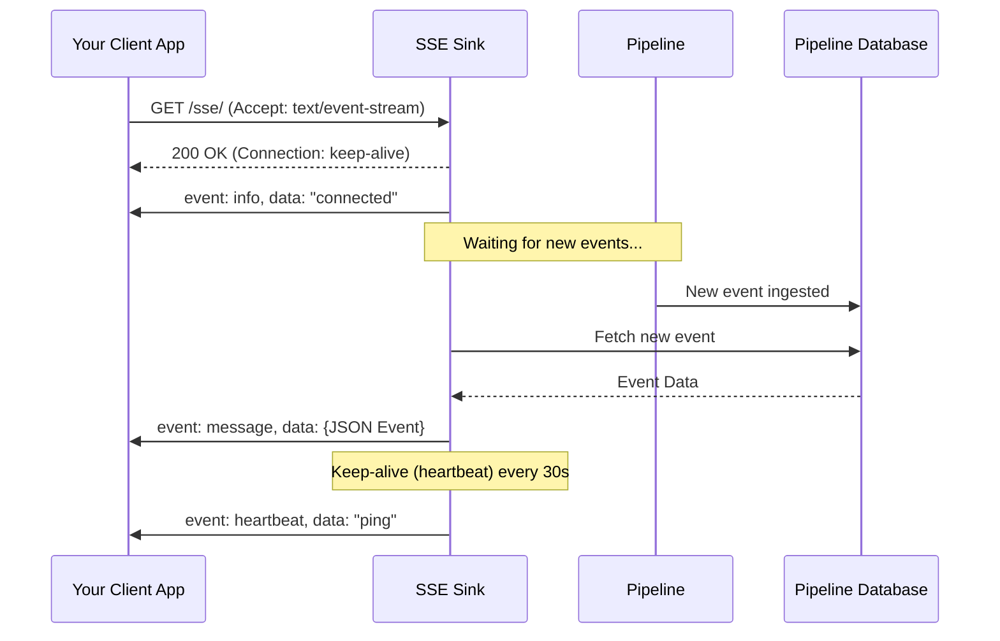

# SSE Sink (Real-time Streaming Delivery)

The Server-Sent Events (SSE) Sink provides a real-time stream of events from the pipeline to your application. This allows your application to maintain a persistent connection to the pipeline and receive updates as they happen.

### Is this the right choice for you?

| Use Case                                                                                                                     | Key Considerations                                                                                             |
|:-----------------------------------------------------------------------------------------------------------------------------|:---------------------------------------------------------------------------------------------------------------|
| **Real-time Dashboards**: Instantly update browser UIs or monitoring tools without refreshing or polling.                    | **Push-Only**: Information flows in one direction, from the server to your app.                                |
| **Simple Integration**: Uses standard HTTP; works with `EventSource` in browsers and simple HTTP clients in other languages. | **Browser Friendly**: Specifically designed to work natively in web browsers without complex socket libraries. |
| **No Public Endpoint Required**: Ideal for internal tools or mobile apps that cannot receive incoming webhook requests.      | **Automatic Reconnection**: Standard clients automatically attempt to reconnect if the network drops.          |

---

## How it Works

### 1. The Streaming Lifecycle
When you connect to the SSE endpoint, the pipeline establishes a "keep-alive" connection. It then monitors for any new events arriving in the database and streams them to you immediately.



### 2. Understanding Core Concepts

#### Immediate Delivery
The sink is designed to minimize latency. As soon as an event is registered in the system, it is pushed to all connected clients that match the filtering criteria.

#### Integrated Event Filtering
You can filter the stream to receive only the events you care about. These filters work together:
- **Server-Side Restriction**: Defined in `config.yaml`, this sets the "boundary" for what this specific sink is allowed to see.
- **Client-Side Refinement**: Using the `event_type` URL parameter, you can further narrow down the stream.

**Important**: The URL parameter can only *further restrict* the events defined in the configuration; it can never bypass the server-side rules.

#### Heartbeats (Keep-Alive)
To ensure the connection remains healthy and is not closed by network hardware during quiet periods, the sink sends a small `heartbeat` event every 30 seconds.

---

## Configuration (`config.yaml`)

### Minimal Configuration
By default, the sink is available at `/{name}/` and streams all events.

```yaml
sink:
  events_stream:
    type: 'sse'
```

### Path and Filtering
You can customize the endpoint path and restrict the events that are allowed to be streamed.

```yaml
sink:
  alerts:
    type: 'sse'
    path: '/live'      # Available at /alerts/live
    match: 'alert.*'   # This sink only sees events starting with "alert."
```

### Coalescing
If multiple similar events arrive in quick succession, you can coalesce them to reduce stream noise.

```yaml
sink:
  ui_updates:
    type: 'sse'
    coalesce:
      - 'stats.*'      # Coalesce events with same type and entity_id
```

---

## Using the Sink

### Connecting via Browser (JavaScript)
```javascript
// This will only receive "user.login" events, 
// provided they also match the 'match' pattern in config.yaml
const eventSource = new EventSource('http://localhost:8000/events_stream/?event_type=user.login');

eventSource.onmessage = (event) => {
    const data = JSON.parse(event.data);
    console.log('New event received:', data);
};

eventSource.addEventListener('info', (event) => {
    console.log('Connection status:', event.data);
});

eventSource.onerror = (error) => {
    console.error('SSE Error:', error);
};
```

### Connecting via CURL
```bash
curl -N http://localhost:8000/events_stream/
```

### Response Format
The sink follows the standard SSE format. Each event is separated by a double newline.

```text
event: info
data: connected

event: message
id: 42
data: {"id": 42, "event_id": "evt_abc", "event_type": "user.login", ...}

event: heartbeat
data: ping
```

#### Request Parameters
- `event_type` (optional): A pattern to filter events (e.g., `user.*`, `*.created`, `my_event`). Note that this **refines** the server-side `match` pattern and cannot derestrict it.
