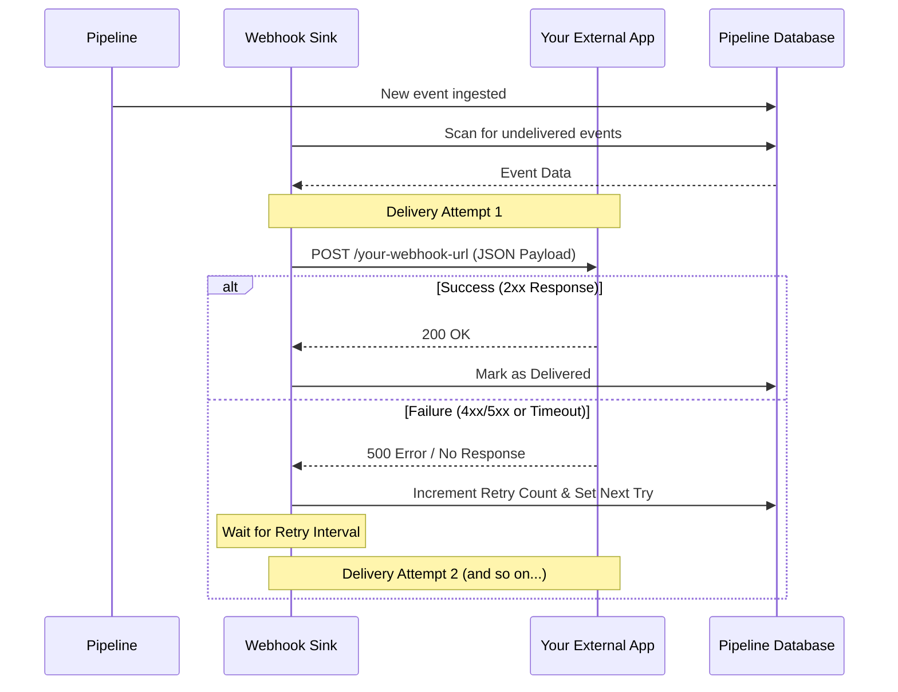

# Webhook Sink (The Push-Based Delivery Model)

The Webhook Sink is a proactive delivery system that automatically pushes events to your external application or service. Unlike "pull-based" systems (like HTTP Pop), where your application must periodically request data, the Webhook Sink initiates an HTTP POST request to a URL you specify as soon as an event enters the pipeline. This ensures near real-time data synchronization.

### Is this the right choice for you?

| Use Case                                                                                                                                                     | Key Considerations                                                                                                                                                              |
|:-------------------------------------------------------------------------------------------------------------------------------------------------------------|:--------------------------------------------------------------------------------------------------------------------------------------------------------------------------------|
| **Real-time Updates**: Data is delivered immediately after it is ingested, minimizing latency.                                                               | **Receiver Availability**: Your application must be online and reachable at the provided URL to receive data.                                                                   |
| **Simplified Logic**: Your application doesn't need to implement polling or manage batching state; it just needs a single endpoint to receive POST requests. | **No Native Backpressure**: The sink will push data as it arrives. If your system is overwhelmed, it must handle the incoming traffic or return error codes to trigger retries. |
| **Serverless/Functions**: Perfect for triggering AWS Lambda, Google Cloud Functions, or Zapier/Make.com workflows.                                           | **Firewall Configuration**: Requires your application to be accessible from the pipeline server (may require open ports or IP whitelisting).                                    |

---

## How it Works

### 1. The Delivery and Retry Lifecycle
The Webhook Sink manages the delivery process automatically, including handling temporary network failures or receiver downtime.

#### Complete Separation for Multiple Sinks
The pipeline supports multiple Webhook sinks simultaneously. Each sink has its own independent "delivered" state in the database. This means if you have `webhook_a` and `webhook_b` both matching the same event:
- `webhook_a` will attempt delivery and track its own retries.
- `webhook_b` will independently attempt its own delivery to its own URL.
- Success or failure for `webhook_a` has no effect on `webhook_b`.



### 2. Understanding Core Concepts

#### Automatic Delivery
The sink continuously monitors the pipeline for new events that match its configuration. When a match is found, it immediately attempts to "push" the data to the configured URL.

#### Time-to-Live (TTL)
To prevent the sink from being overwhelmed by very old events (e.g., after a long downtime), you can configure a Time-to-Live (TTL). Events older than the TTL will be ignored and not attempted for delivery.
- **`ttl_enabled`**: Whether to enforce TTL (default is `true`).
- **`default_ttl`**: The default age after which an event is considered "expired" (e.g., `"1h"`, `"1d"`).
- **`event_ttl`**: Specific TTL values for different event types (e.g., `"critical.*": "7d"`).

#### Reliable Retries
Network blips and temporary server outages happen.
- **Max Retries**: The sink will try to deliver the event multiple times (default is 3) before giving up.
- **Retry Interval**: Between attempts, the sink waits for a specified period (default is 10 seconds) to allow the receiving system to recover.
- **Persistence**: Delivery status and retry counts are tracked in the pipeline database, ensuring no event is lost even if the pipeline service restarts.

---

## Configuration (`config.yaml`)

### Minimal Configuration
The only mandatory field is the target `url`. By default, it will push all events (`*`) with 3 retries.

```yaml
sink:
  my_webhook:
    type: 'webhook'
    url: 'https://api.myapp.com/events'
```

### Named Sink with Filtering
You can restrict the webhook to specific event types. This is useful for sending different events to different microservices.

```yaml
sink:
  slack_notifications:
    type: 'webhook'
    url: 'https://hooks.slack.com/services/...'
    match: 'alert.*' # Only push events starting with "alert."
```

### Full Configuration Example
This example shows a custom retry policy, multiple match patterns, and TTL settings.

```yaml
sink:
  critical_audit_log:
    type: 'webhook'
    url: 'https://audit-service.internal/ingest'
    max_retries: 10
    retry_interval: 60.0  # Wait 60 seconds between retries
    ttl_enabled: true
    default_ttl: '24h'    # Expire most events after 1 day
    event_ttl:
      'security.*': '30d' # Keep security events for 30 days
    match:
      - 'user.auth.*'
      - 'payment.processed'
      - 'security.breach'
```

---

## Webhook Payload

When the sink sends data to your URL, it uses an HTTP **POST** request with a `application/json` body.

**Request Structure:**
```json
{
  "event_id": "evt_12345",
  "event_type": "user.auth.login",
  "entity_id": "user_99",
  "created_at": "2024-03-13T23:52:00Z",
  "data": {
    "ip_address": "192.168.1.1",
    "browser": "Chrome"
  },
  "meta": {
    "source": "auth-service-01"
  }
}
```

### Handling the Response
- **Success**: Return any `2xx` status code (e.g., `200 OK`, `202 Accepted`) to confirm receipt. The sink will mark the event as delivered.
- **Retry**: Return a `4xx` or `5xx` status code if your system is temporarily unable to process the event. The sink will attempt delivery again later based on your `max_retries` setting.
- **Timeout**: The sink waits up to 10 seconds for a response. If your server takes longer, it will be treated as a failure and triggered for retry.
