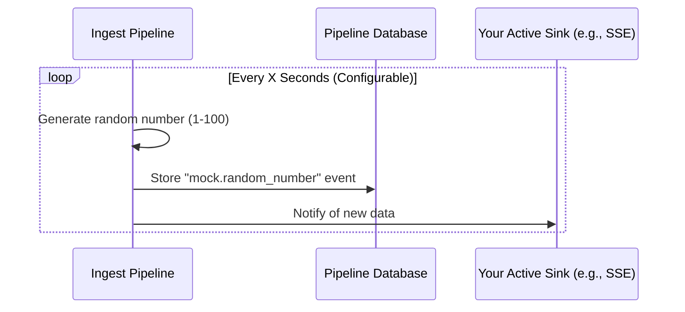

# Mock Event Source (Heartbeat and Testing)

The Mock Event Source is a testing and diagnostic tool designed to generate continuous, predictable "heartbeat" events within the ingest pipeline. It automatically creates events with a random numeric payload at a specified interval, making it perfect for verifying your sinks and monitoring the pipeline's overall health without relying on external data providers.

### Is this the right choice?

| Use Case                                                                                                                       | Considerations                                                         |
|:-------------------------------------------------------------------------------------------------------------------------------|:-----------------------------------------------------------------------|
| **Pipeline Verification**: Quickly test if your sinks (Webhooks, SSE, HTTP Pull) are correctly receiving and processing events. | **Non-Production Tool**: Use primarily for development and monitoring. |
| **Heartbeat & Monitoring**: Ensure the pipeline is alive with a steady stream of data.                                         | **Simple Payload**: Generates a random number (1-100).                 |
| **Load Testing**: Simulate high-frequency data streams.                                                                        |                                                                        |

---

## How it Works

The Mock Source runs as a background task within the ingest pipeline application. Once initialized based on your configuration, it starts a simple timer loop. Every time the timer expires, it generates a new event and stores it in the pipeline database.



### Configurable Intervals
You can use time interval strings like `"5s"`, `"1m"`, or `"1d"`. 

#### Event Frequency and Resource Management
Short intervals (like `"5s"`) lead to rapid database growth since every event is stored. For long-term monitoring, intervals between `1m` and `1h` are generally recommended.

---

## Configuration (`config.yaml`)

### Minimal Configuration
The simplest way to get a mock stream running. It defaults to a **10-second** interval.

```yaml
sources:
  test_random_source:
    type: "mock"
```

### Full Configuration Example
This example shows a more frequent interval and how to set multiple mock sources for different testing scenarios.

```yaml
sources:
  high_frequency_test:
    type: "mock"
    interval: "5s"       # Generates data every 5 seconds
  daily_heartbeat:
    type: "mock"
    interval: "24h"      # Generates data once a day
```

---

## Event Structure Example

When the Mock Source generates an event, it will look like this in your database or sink payloads:

```json
{
  "event_id": "550e8400-e29b-41d4-a716-446655440000",
  "event_type": "mock.random_number",
  "entity_id": "mock-test_random_source",
  "data": {
    "number": 42
  },
  "occurred_at": "2026-03-14T12:00:00Z"
}
```

*Note: The `entity_id` is automatically prefixed with `mock-` followed by the name you gave the source in your configuration.*
